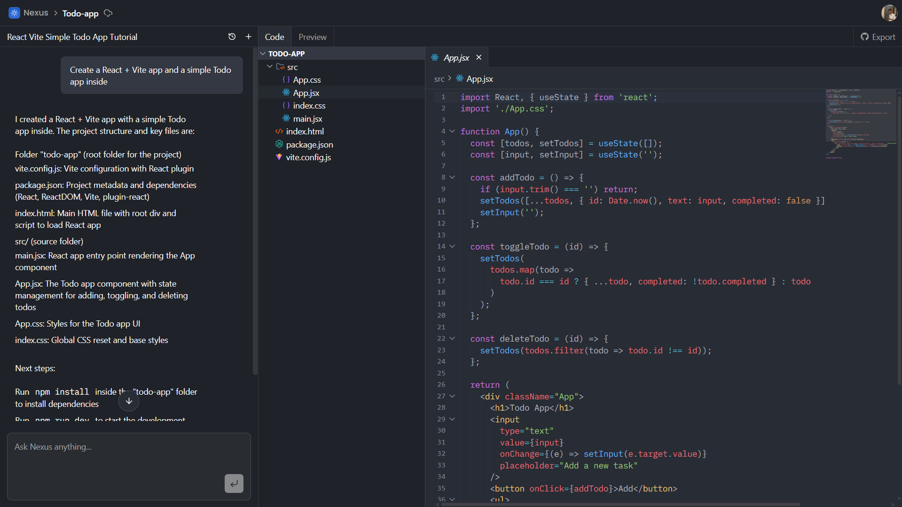

# 🚀 Nexus — Build Your Own AI-Powered IDE

## 📸 Screenshot



---

## ✨ What is Nexus?

Nexus is a **browser-based AI-powered IDE**, designed to bring intelligent coding and collaboration directly into the browser.

### 🔥 Features

- ⚡ Real-time collaborative code editing  
- 🤖 AI-powered code suggestions (ghost text)  
- ⌘ Quick edit with natural language (Cmd + K)  
- 💬 Conversation-based AI assistant  
- 🌐 In-browser execution with WebContainer  
- 📁 Multi-file project management  
- 🔗 GitHub import/export (planned)

---

## 🧰 Tech Stack

| Category      | Technologies |
|--------------|-------------|
| **Frontend**  | Next.js 16, React 19, TypeScript, Tailwind CSS 4 |
| **Editor**    | CodeMirror 6, Custom Extensions |
| **Backend**   | Convex, Inngest |
| **AI**        | OpenAI GPT-4.1 Mini |
| **Auth**      | Clerk |
| **Execution** | WebContainer API, xterm.js |
| **UI**        | shadcn/ui, Radix UI |

---

## 🧩 Project Phases

### 🔹 Core Setup

- Branch 1: Project Setup & UI Theme  
- Branch 2: Clerk Authentication  
- Branch 3: Convex Real-time Database  
- Branch 4: Inngest Jobs  
- Branch 5: Firecrawl Integration  
- Branch 6: Sentry Monitoring  
- Branch 7: Dashboard  

### 🧠 IDE Development

- Branch 8: IDE Layout  
- Branch 9: File Explorer  
- Branch 10: Code Editor  

### 🤖 AI Features

- Branch 11: AI Suggestions  
- Branch 12: Conversation System  

### 🚧 More Features

- Branch 13: AI Agent  
- Branch 14: WebContainer Execution  
- Branch 15: GitHub Integration  
- Branch 16: AI Project Generation  

---

## ⚙️ Getting Started

### 📌 Prerequisites

- Node.js 20+  
- npm / pnpm  
- Required accounts:
  - Clerk  
  - Convex  
  - Inngest  
  - OpenAI  

---

### 🔧 Installation

```bash
git clone https://github.com/srnsksyp/nexus.git
cd nexus
npm install
```

### 🔑 Environment Setup

```bash
cp .env.example .env.local
```

**Clerk**
```
NEXT_PUBLIC_CLERK_PUBLISHABLE_KEY=
CLERK_SECRET_KEY=
```

**Convex**
```
NEXT_PUBLIC_CONVEX_URL=
CONVEX_DEPLOYMENT=
NEXUS_CONVEX_INTERNAL_KEY=
```

**AI**
```
OPENAI_API_KEY=
```

**Optional**
```
FIRECRAWL_API_KEY=
SENTRY_DSN=
```

### ▶️ Run the App

```bash
# Convex
npx convex dev

# Next.js
npm run dev

# Inngest
npx inngest-cli@latest dev
```

Open 👉 [http://localhost:3000](http://localhost:3000)

---

## 📁 Project Structure

```
src/
├── app/
│   ├── api/
│   │   ├── messages/
│   │   ├── suggestion/
│   │   └── quick-edit/
│   └── projects/
├── components/
│   ├── ui/
│   └── ai-elements/
├── features/
│   ├── auth/
│   ├── conversations/
│   ├── editor/
│   ├── preview/
│   └── projects/
├── inngest/
└── lib/

convex/
├── schema.ts
├── projects.ts
├── files.ts
├── conversations.ts
└── system.ts
```

---

## ⚡ Features

### 📝 Editor
- Syntax highlighting
- Minimap & code folding
- Multi-cursor editing
- Bracket matching

### 🤖 AI Capabilities
- Ghost text suggestions
- Cmd + K quick edits
- Inline actions
- Chat assistant

### 📂 File Management
- File explorer
- Create / rename / delete
- Tab navigation
- Auto-save

### 🔄 Real-time
- Instant sync with Convex
- Optimistic UI updates
- Background jobs


---

## 📜 Scripts

```bash
npm run dev      # Start development server
npm run build    # Build for production
npm run start    # Start production server
npm run lint     # Run ESLint
```

---

## 🙌 Acknowledgements

- [VS Code](https://github.com/microsoft/vscode)
- [Orchids](https://orchids.app)
- [shadcn/ui](https://ui.shadcn.com)
- [CodeMirror](https://codemirror.net)

---

## 💡 Vision

Build a fully AI-native development environment where coding, debugging, and collaboration happen seamlessly with AI — directly in the browser.
